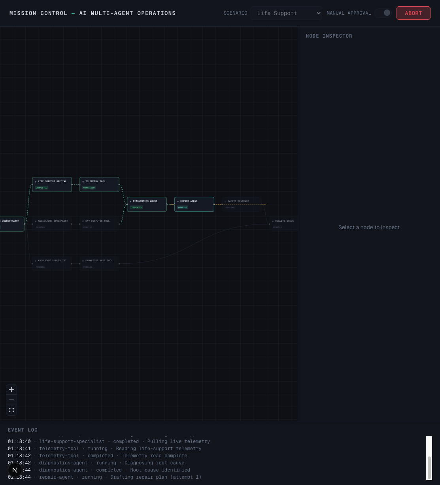
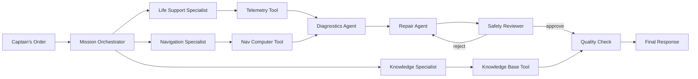
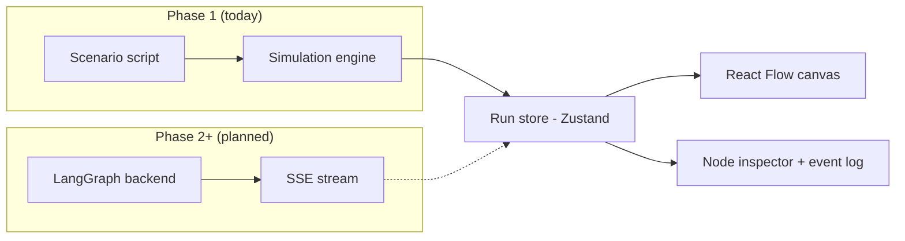

# Mission Control AI

An interactive, playable demo of a multi-agent AI system, styled as a
spacecraft mission — no dashboard, no dropdown, just an inbox and a console.
You take the conn of the **ISV Meridian**, mid-transit to survey world
**XJS-7**. Mission directives arrive by email; you relay them to **VEGA**,
the ship's onboard intelligence, by typing free-form orders into its command
console. VEGA routes each order to the right specialist crew, which
diagnoses, calls tools, drafts a fix, and clears safety review — all
rendered live on a [React Flow](https://reactflow.dev/) graph.

Built with a [LangGraph](https://www.langchain.com/langgraph)-shaped
orchestration graph: an orchestrator interprets each free-text order and
routes it to one of three specialist agents, tool calls fetch data, a
reviewer can reject and force a retry, and one mission always pauses for the
captain's own authorization before it proceeds.


*(More screenshots in `docs/screenshots/` — the mission inbox, the command
console mid-run, and the captain-authorization pause.)*

## What this demonstrates

- **Multi-agent orchestration** — a central orchestrator delegates to
  domain-specific specialist agents instead of one monolithic prompt.
- **Intent routing from natural language** — there's no scenario switch;
  VEGA's console takes a free-text order and matches it to a crew by intent.
  See [Missions](#missions) below for the keyword table this maps to.
- **Dynamic routing** — the path through the graph depends on the request;
  see [Missions](#missions) below for a routing-only example.
- **Guardrails** — an order that matches no crew or ship system is declined
  in-character rather than forced down a path; see the guardrail row in
  [Missions](#missions).
- **Tool calling** — specialists call dedicated tool nodes (telemetry, nav
  computer, knowledge base) and reason over the results.
- **Retries & fallbacks** — a rejected output is revised and resubmitted
  rather than failing the run.
- **Reviewer loop** — a safety-reviewer agent gates risky actions and can
  reject a plan, looping back to the agent that produced it.
- **Narrative human-in-the-loop** — the navigation mission always halts at
  a captain-authorization interrupt before the correction burn fires; the
  captain must Approve or Reject in character, not toggle a setting.
- **Event streaming** — the entire run is a stream of typed events over a
  frozen contract, designed to be transport-agnostic (see
  [`docs/FLOW.md`](docs/FLOW.md#event-contract)).
- **LangSmith tracing** *(planned)* — each node event carries an optional
  `traceUrl` slot reserved for per-node trace links.
- **Typed event contract** — a single TypeScript source of truth
  (`frontend/src/lib/types/events.ts`) shared by the simulator today and the
  real backend later, so the UI never has to change when the data source does.
- **React Flow visualization** — a read-only, fixed-topology graph with
  animated edges on the active path and a node inspector for details.

## Current status

**Phase 1 — complete.** The app runs entirely in the frontend: a simulation
engine plays scripted event sequences through the same store a real backend
will feed later, triggered by the free-text console and keyword routing
described above. No server, no LLM calls, no API keys required.

| Phase | Scope | Status |
|-------|-------|--------|
| 1 | Simulated event engine, frontend-only vertical slice | Done |
| 2 | Real FastAPI + LangGraph backend, SSE streaming, optional OpenAI (`gpt-4o-mini`) with simulated fallback | Planned |
| 3 | LangSmith tracing, run metrics, failure injection | Planned |
| 4 | Visual polish, more scenarios, Railway deployment | Planned |

## How to play

```bash
cd frontend
npm install
npm run dev
```

Open `http://localhost:3000` and:

1. **Check your mail** — a badge on the inbox icon means new traffic. A
   welcome message arrives first; closing it brings in three mission
   directives at once.
2. **Read the directives** — each mission email describes an in-world
   problem (an intel request, a life-support anomaly, a nav deviation) and
   closes by telling you to relay it to VEGA.
3. **Type your orders** — put the gist of a directive into VEGA's command
   console in your own words. There's no menu to pick from; the console
   free-texts straight into the orchestrator, which figures out which crew
   owns it (or declines it — see [Missions](#missions)).
4. **Authorize the burn** — order the navigation correction and the run will
   stop mid-way, waiting on your explicit Approve/Reject before the
   thrusters fire.

## Missions

| Mission (email) | Try typing | What it shows |
|-----------------|------------|---------------|
| **Long-range intel** (*Mission Intelligence*) | *"Give me a status report and ETA to XJS-7."* | **Short-circuit routing**: the orchestrator sends this straight to the knowledge specialist, which skips diagnostics, repair, and review entirely and goes directly to the quality check. Demonstrates that the graph's path is data-dependent, not fixed. |
| **Life-support anomaly** (*Flight Surgeon*) | *"Oxygen pressure is dropping in the life support module."* | The full pipeline, including a **reviewer rejection and retry**: the safety reviewer rejects the first repair plan (it re-pressurizes before isolating the faulty valve), the repair agent revises it, and the second pass is approved. |
| **Approach correction** (*Navigation Control*) | *"Trajectory deviation detected on approach vector."* | The full pipeline, gated by a **captain-authorization pause**: the run halts right after the reviewer requests a verdict and waits for you to Approve or Reject the correction burn — approve for a clean pass, reject to watch the same retry loop as life support. |
| *(anything off-mission)* | *"What's for dinner tonight?"* | **Guardrail**: the orchestrator can't match the order to any crew or ship system, halts itself, and VEGA replies in character that the request isn't relevant to the mission — no path is forced. |

Routing is keyword-based in Phase 1 (see `frontend/src/lib/simulation/router.ts`)
and will move to a real LLM router in Phase 2 behind the same interface — the
console UI doesn't change either way. See [`docs/FLOW.md`](docs/FLOW.md) for
the full step-by-step walkthrough.

## Architecture overview

The graph topology is fixed (no editing, dragging allowed) so a run always
highlights a subset of the same nodes and edges, whichever mission the
order routed to. Full node/edge definitions live in
`frontend/src/lib/graph/topology.ts`; the canonical description is in
[`ARCHITECTURE.md`](ARCHITECTURE.md).



The **event pipeline** is decoupled from its source: today a scripted
simulator plays events, tomorrow a real LangGraph backend will stream the
same event shapes over SSE. The store and UI don't know or care which one is
feeding them.



## Tech stack

| Layer | Technology |
|-------|-----------|
| Framework | Next.js 16 (App Router) + TypeScript |
| Graph visualization | React Flow (`@xyflow/react`) |
| State | Zustand |
| Styling | Tailwind CSS (dark theme) |
| Backend *(Phase 2+)* | FastAPI + LangGraph, SSE |
| LLM *(Phase 2+, optional)* | OpenAI `gpt-4o-mini`, simulated fallback when no key is set |
| Tracing *(Phase 3)* | LangSmith |
| Deployment *(Phase 4)* | Railway |

## Learn more

- [`docs/FLOW.md`](docs/FLOW.md) — a plain-English, step-by-step walkthrough
  of a full run, plus the event contract with a worked example.
- [`ARCHITECTURE.md`](ARCHITECTURE.md) — full topology, event contract, and
  API design.
